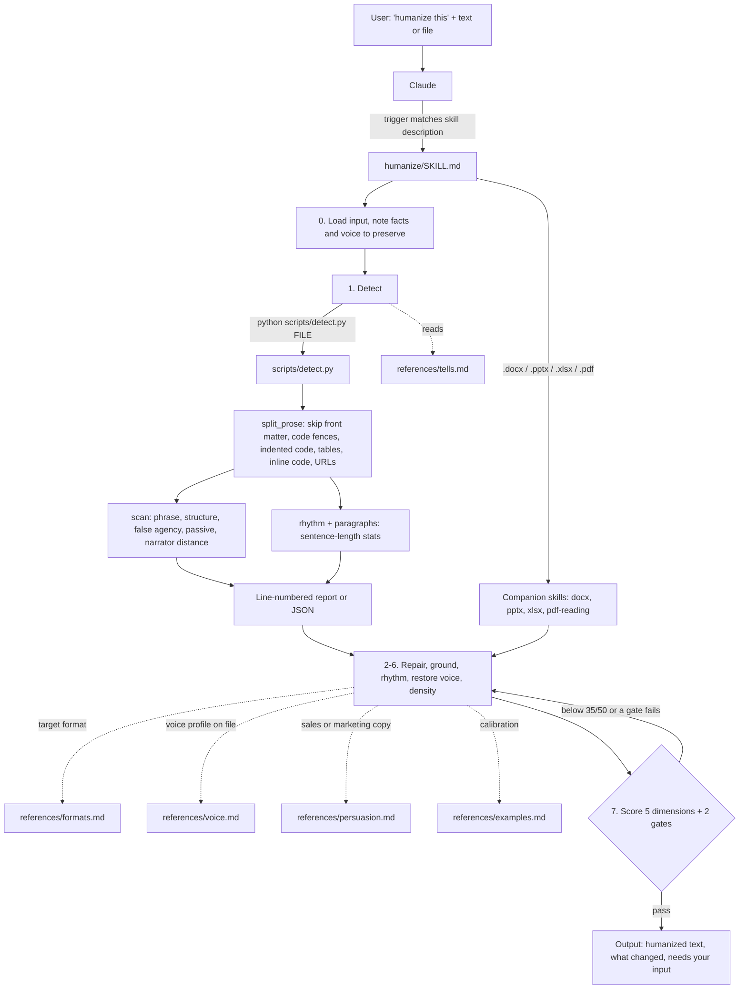

<p align="center">
  
</p>

<p align="center">
  <a href="https://github.com/StudyMyPlays/humanizeai/commits"></a>
  <a href="https://github.com/StudyMyPlays/humanizeai"></a>
  <a href="https://github.com/StudyMyPlays/humanizeai"></a>
  <a href="https://github.com/StudyMyPlays/humanizeai/stargazers"></a>
  <a href="https://github.com/StudyMyPlays/humanizeai/issues"></a>
</p>

<p align="center">
  <b>A Claude skill that rewrites AI-sounding text so it reads like a person wrote it, without changing what it says.</b><br>
  Ships with <code>detect.py</code>, a standard-library Python scanner that flags AI writing tells by line number.
</p>

---

## Overview

Humanize OS is a [Claude Agent Skill](https://docs.claude.com/en/docs/agents-and-tools/agent-skills/overview) named `humanize`. When you ask Claude to "humanize this", "make this sound less like ChatGPT", or "fix this writing", the skill takes over: it scans the draft for known AI patterns, repairs the smallest unit that fixes each one, scores the result, and returns the text in its original format.

One rule overrides everything else: **never invent.** Every concrete detail in the output must exist in the input. The skill cuts, sharpens, reorders, and rephrases. It does not add anecdotes, numbers, names, dates, quotes, or results. When a passage is flat and has nothing concrete to work with, the skill cuts it or asks you a specific question instead of making something up.

The repository has two parts:

| Part | What it is |
| --- | --- |
| [`humanize/SKILL.md`](humanize/SKILL.md) plus [`humanize/references/`](humanize/references) | Instructions Claude follows: the 8-step workflow, the preservation rules, format routing, and the scoring rubric |
| [`humanize/scripts/detect.py`](humanize/scripts/detect.py) | A standalone CLI that scans prose for AI tells and rhythm problems. You can run it without Claude |

## Features

- **Fact preservation.** Code, commands, config, file paths, numbers, dates, prices, proper nouns, URLs, citations, legal language, and attributed quotes stay byte-identical.
- **Scan before rewriting.** `detect.py` reports phrase tells, structural formulas, false agency, passive voice, narrator distance, and rhythm problems with line numbers, so Claude edits specific passages instead of regenerating the whole document.
- **Pattern library.** [`references/tells.md`](humanize/references/tells.md) documents each pattern and when it's legitimate: filler, vocabulary tells, binary contrast, negative listing, dramatic fragments, false agency, passive voice, narrator distance, manufactured quotables, rhythm, and reader-trust violations.
- **Format-aware output.** Handles `.md`, `.txt`, pasted text, `.docx`, `.pptx`, `.xlsx`/`.csv`, `.pdf`, and code comments, and returns the original format.
- **Platform adapters.** [`references/formats.md`](humanize/references/formats.md) sets norms for long-form articles, LinkedIn, X, Reddit, email, technical docs, landing pages, slides, scripts, academic writing, and legal/compliance text.
- **Voice profiles.** Give Claude three to five samples of your own writing and it builds a reusable `voice-profile.md` ([`references/voice.md`](humanize/references/voice.md)).
- **Persuasion integrity.** A non-manipulation gate for sales and marketing copy blocks invented urgency, fake social proof, and pressure that wasn't in the source ([`references/persuasion.md`](humanize/references/persuasion.md)).
- **"Needs your input" list.** Vague claims the source can't support honestly become specific questions for you, not fabricated specifics.
- **No detector chasing.** The skill targets writing quality, not AI-detector scores. Detectors are unreliable in both directions and flag non-native English speakers and technical writing at elevated rates.

## Architecture



`detect.py` is the only executable code. Everything else is Markdown that Claude reads on demand. `SKILL.md` tells Claude to load the reference files as needed rather than all at once.

## Demo

[](#usage)

[](#scanner-cli)

Real output from running the scanner on the repo's own before/after examples, filtered to high severity:

```console
$ python scripts/detect.py references/examples.md --min-severity high
AI-tell scan: references/examples.md
============================================================

9 flags (phrase 6, structure 3)


--- PHRASE ---
  L9    [high  ] reader-trust violation: "Let that sink in"
         -> State the point; drop the instruction to the reader.
  L17   [high  ] throat-clearing opener: "The uncomfortable truth is"
         -> Delete the opener; start at the content.
  L17   [high  ] reader-trust violation: "And that's okay"
  L41   [high  ] reader-trust violation: "What if I told you"
  L41   [high  ] reader-trust violation: "Here's what I mean"
...
```

## Installation

<details>
<summary><b>Install the skill</b></summary>

<br>

**Requirements**

- A Claude product that supports Agent Skills (Claude Code, Claude apps, or Cowork)
- Python 3 on the machine where Claude runs, for the scanner step. The scanner uses only the standard library and has been run on Python 3.11
- For `.docx`, `.pptx`, `.xlsx`, and `.pdf` input: the `docx`, `pptx`, `xlsx`, and `pdf-reading` skills, which `SKILL.md` hands off to. Plain text and Markdown need nothing extra

**Clone**

```bash
git clone https://github.com/StudyMyPlays/humanizeai.git
cd humanizeai
```

**Claude Code: personal skill (all projects)**

```bash
mkdir -p ~/.claude/skills
cp -r humanize ~/.claude/skills/humanize
```

**Claude Code: project skill (one repository)**

```bash
mkdir -p /path/to/your-project/.claude/skills
cp -r humanize /path/to/your-project/.claude/skills/humanize
```

Claude Code discovers `SKILL.md` in either location. Restart the session if it was already running.

**Cowork**

Keep the `humanize/` directory in your Cowork workspace and point Claude at `humanize/SKILL.md`. The skill's own [`humanize/README.md`](humanize/README.md) also refers to a packaged `humanize.skill` file saved from a file card. That package isn't committed here; the folder is the source it's built from.

**Scanner only (no Claude)**

Nothing to install. Run it with any Python 3 interpreter:

```bash
python3 humanize/scripts/detect.py path/to/draft.md
```

</details>

## Configuration

<details>
<summary><b>Configure triggers, severity, and voice</b></summary>

<br>

There are no environment variables, API keys, or config files. Behavior is controlled in three places.

**Skill trigger.** The `description` field in the front matter of [`humanize/SKILL.md`](humanize/SKILL.md) decides when Claude loads the skill. Edit it to add or remove trigger phrases. The `name` field (`humanize`) matches the folder name; keep them in sync if you rename either.

**Scanner flags**

| Flag | Default | Effect |
| --- | --- | --- |
| `file` (positional) | required | Path to scan, or `-` to read stdin |
| `--report` | on | Human-readable report. This is already the default output |
| `--json` | off | Machine-readable output. Takes precedence if both `--json` and `--report` are passed |
| `--min-severity` | `low` | `low`, `medium`, or `high`. Drops findings below that level. Rhythm and paragraph checks always run |

**Scanner patterns.** The pattern tables live at the top of [`detect.py`](humanize/scripts/detect.py): `PHRASE_PATTERNS` and `STRUCTURE_PATTERNS` are lists of `(name, regex, severity, note)`, and `FALSE_AGENCY`, `PASSIVE`, and `NARRATOR_DISTANCE` are single compiled regexes. Rhythm thresholds are literals inside `rhythm()` and `paragraphs()` (see [Algorithms](#algorithms)).

**Voice profile.** For writing published under your name, give Claude three to five pieces you wrote and liked. It writes a `voice-profile.md` into your working folder and reuses it on later jobs. See [`references/voice.md`](humanize/references/voice.md).

</details>

## Local development

<details>
<summary><b>Work on the skill or the scanner</b></summary>

<br>

```bash
git clone https://github.com/StudyMyPlays/humanizeai.git
cd humanizeai/humanize

# Run the scanner against the repo's own calibration examples
python3 scripts/detect.py references/examples.md
python3 scripts/detect.py references/examples.md --min-severity high
python3 scripts/detect.py references/examples.md --json
```

To test changes to `SKILL.md` or the references with Claude Code, symlink the folder instead of copying it so edits apply immediately:

```bash
mkdir -p ~/.claude/skills
ln -s "$(pwd)" ~/.claude/skills/humanize
```

There's no build step, dependency file, linter config, or type checker in the repo.

</details>

## Usage

### With Claude

Once installed, the skill triggers on requests like:

- "humanize this"
- "make this sound less like AI" / "less like ChatGPT"
- "fix this writing" / "this reads like AI"
- dropping a `.md`, `.txt`, `.docx`, `.pptx`, `.xlsx`, or `.pdf` and asking for a rewrite

Claude returns three things, in this order:

1. **The humanized text**, clean, with no inline commentary or change markers
2. **What changed**, three to six lines naming the main patterns removed
3. **Needs your input**, only when it applies: passages too vague to sharpen honestly, each with the question that would fix it

If a document needs restructuring rather than line editing, the skill asks before doing it.

### Scanner CLI

```bash
python3 humanize/scripts/detect.py draft.md
python3 humanize/scripts/detect.py draft.md --min-severity high
cat draft.md | python3 humanize/scripts/detect.py - --json
```

The scanner skips front matter, fenced code, lines indented with four spaces or a tab, table rows, inline code, and URLs, so it never flags content the skill treats as untouchable.

Findings fall into five categories:

| Category | Examples of what it catches | Severity |
| --- | --- | --- |
| `phrase` | throat-clearing openers, meta-commentary, reader-trust violations, empty intensifiers, AI vocabulary, vague quantifiers and nouns, corporate filler, hedge stacks | low to high |
| `structure` | binary contrast, negative listing, rhetorical question setups, dramatic fragment stacks, slogan closers, em-dash reversals | low to high |
| `false-agency` | abstract subjects doing human things ("the data tells", "the market wants") | high |
| `passive` | `was/is/been` + a common past participle | low |
| `narrator-distance` | "people tend to", "one might", "it is widely believed that" | medium |

JSON output shape:

```json
{
  "file": "draft.md",
  "findings": [
    {
      "line": 1,
      "category": "phrase",
      "pattern": "throat-clearing opener",
      "match": "It's worth noting that",
      "severity": "high",
      "note": "Delete the opener; start at the content."
    }
  ],
  "rhythm": { "sentence_count": 0, "flags": [], "mean_length": 0, "stdev_length": 0.0 },
  "paragraphs": { "paragraph_count": 0, "flags": [] }
}
```

Flags are candidates, not verdicts. Every pattern has a legitimate use somewhere, and [`references/tells.md`](humanize/references/tells.md) says where.

## Algorithms

The scanner's rhythm checks and the skill's scoring rubric are the two quantitative parts of the project.

### Sentence-length rhythm (`rhythm()` in `detect.py`)

All prose lines are joined and split into sentences at whitespace following `.`, `!`, or `?`. Sentences of one word or fewer are dropped. For the remaining $n$ sentences with word counts $\ell_1, \dots, \ell_n$ (whitespace-split):

$$\bar{\ell} = \frac{1}{n}\sum_{i=1}^{n} \ell_i \qquad \sigma = \sqrt{\frac{1}{n}\sum_{i=1}^{n}\left(\ell_i - \bar{\ell}\right)^2}$$

$\sigma$ is the population standard deviation (`statistics.pstdev`). With fewer than 3 sentences no flags are raised. Otherwise:

| Check | Flag condition |
| --- | --- |
| Uniform length | $\sigma < 4.5$ words |
| Metronome run | a run of at least 4 consecutive sentences where each adjacent pair satisfies $\lvert \ell_i - \ell_{i-1} \rvert \le 3$ |
| Repeated openers | 3 or more consecutive sentences start with the same first word (lowercased, trailing comma stripped) |
| Triad reflex | at least 4 matches of the pattern `word, word, and word` across all prose |

### Paragraph shape (`paragraphs()`)

Text is split on blank lines. Blocks starting with `#`, `|`, a code fence, `-`, or `*` are excluded. For the remaining $m$ paragraphs with sentence counts $c_1, \dots, c_m$, the scanner flags uniform paragraph shape when

$$m \ge 4 \quad\text{and}\quad \sigma_c = \sqrt{\frac{1}{m}\sum_{j=1}^{m}\left(c_j - \bar{c}\right)^2} < 0.8$$

### Severity filter

Severities map to ranks $\text{low}=0$, $\text{medium}=1$, $\text{high}=2$. A finding $f$ is kept when $\text{rank}(f) \ge \text{rank}(\texttt{--min-severity})$. The report sorts each category by descending severity, then by line number.

### Quality score (`SKILL.md`, step 7)

Claude rates the rewrite from 1 to 10 on five dimensions $d \in \{\text{Directness}, \text{Rhythm}, \text{Trust}, \text{Authenticity}, \text{Density}\}$:

$$S = \sum_{d} s_d, \qquad s_d \in [1, 10], \qquad S \in [5, 50]$$

The rewrite passes only when

$$S \ge 35 \;\land\; \text{Fidelity} \;\land\; \text{Non-manipulation}$$

Fidelity (every fact, number, and name traces back to the input) and Non-manipulation (no invented urgency, fake social proof, or new pressure) are pass/fail gates. A failure on either means another pass regardless of $S$. Claude re-scores after each revision because rewrites introduce their own tells.

## Project structure

```text
humanizeai/
├── README.md                  # This file
├── assets/
│   └── banner.svg             # Animated README banner
└── humanize/                  # The skill folder; copy this into your skills directory
    ├── SKILL.md               # Core rules, 8-step workflow, format routing, scoring
    ├── README.md              # Short readme that ships with the skill
    ├── references/
    │   ├── tells.md           # Pattern library and when each pattern is fine
    │   ├── formats.md         # Per-platform norms (LinkedIn, X, email, docs, legal, ...)
    │   ├── voice.md           # Building and reusing a voice profile
    │   ├── persuasion.md      # Integrity checks for sales and marketing copy
    │   └── examples.md        # Before/after calibration
    └── scripts/
        └── detect.py          # Standard-library scanner: pattern flags + rhythm metrics
```

## Testing

There's no automated test suite or CI workflow in this repository. To check the scanner by hand after changing a pattern:

```bash
cd humanize

# Should report 9 high-severity flags (6 phrase, 3 structure)
python3 scripts/detect.py references/examples.md --min-severity high

# Should flag a throat-clearing opener, AI vocabulary, and false agency on line 1
echo "It's worth noting that we leverage robust synergy. The data tells us." \
  | python3 scripts/detect.py - --json
```

`references/examples.md` contains deliberate AI-style "before" passages, so it works as a regression fixture: a pattern change that shifts its flag count deserves a second look.

## Troubleshooting

<details>
<summary><b>Common problems</b></summary>

<br>

**The skill doesn't trigger.**
Check that `SKILL.md` sits directly inside the skill folder (`~/.claude/skills/humanize/SKILL.md`, not `~/.claude/skills/humanize/humanize/SKILL.md`). Restart Claude Code after installing. You can also invoke it explicitly: "use the humanize skill on this".

**`python: command not found`.**
Some systems ship only `python3`. The skill's docs use `python`; run `python3 scripts/detect.py ...` instead.

**`No such file: draft.md`.**
The scanner exits with status 1 when the path doesn't exist. Paths are relative to your current directory, so run it from where the file is or pass an absolute path. Use `-` to read from stdin.

**A line I expected to be flagged wasn't.**
The scanner ignores front matter, fenced code, table rows, and any line indented with four spaces or a tab. Indented prose (for example, continuation lines in a nested list) is skipped too. Inline code and URLs are blanked out before matching.

**Rhythm stats look off on documents with many headings.**
Only a heading at the very start of the text has its `#` markers stripped. Later headings are joined into the neighboring sentence, which skews sentence-length numbers on heading-heavy files.

**No rhythm or paragraph flags on a short draft.**
Rhythm flags need at least 3 sentences. The paragraph-shape check needs at least 4 prose paragraphs.

**Using the scanner as a CI gate.**
The scanner exits 0 whether or not it finds anything. To fail a build on findings, parse `--json` output and check `findings` yourself.

**`.docx`, `.pptx`, `.xlsx`, or `.pdf` input fails.**
`SKILL.md` delegates these to the `docx`, `pptx`, `xlsx`, and `pdf-reading` skills. Make sure those are available in your Claude environment.

**The output still "reads like AI" to a detector.**
That's expected and not a goal. The skill optimizes for writing quality, not detector scores.

</details>

## Contributing

Contributions are welcome through issues and pull requests on [StudyMyPlays/humanizeai](https://github.com/StudyMyPlays/humanizeai).

- **New scanner pattern:** add a `(name, regex, severity, note)` tuple to `PHRASE_PATTERNS` or `STRUCTURE_PATTERNS` in `detect.py`, and document the pattern, its fix, and when it's legitimate in `references/tells.md`. Keep the scanner standard-library only.
- **New platform:** add a section to `references/formats.md`.
- **Calibration:** add before/after pairs to `references/examples.md`, including cases where the right move is a small edit plus a question.
- **Keep the rule:** any change to `SKILL.md` has to preserve "never invent." Prompts or examples that encourage fabricated specifics won't be merged.

Run the manual checks in [Testing](#testing) before opening a pull request.

## License

This repository doesn't include a license file yet. Until one is added, the default copyright rules apply and others can't legally reuse the code. If you want people to use and share it, add a `LICENSE` file (for example MIT or Apache-2.0) at the repository root.
